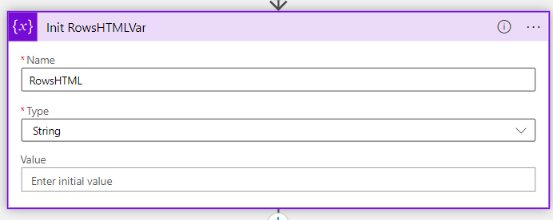

## *Trigger - Recurrence*


## **HTTP Request**


## **ParseReturnedJson**


Schema
```
{
    "properties": {
        "count": {
            "type": "integer"
        },
        "data": {
            "items": {
                "properties": {
                    "eventType": {
                        "type": "string"
                    },
                    "extendedLocation": {},
                    "id": {
                        "type": "string"
                    },
                    "identity": {},
                    "kind": {
                        "type": "string"
                    },
                    "location": {
                        "type": "string"
                    },
                    "managedBy": {
                        "type": "string"
                    },
                    "name": {
                        "type": "string"
                    },
                    "plan": {},
                    "properties": {
                        "properties": {
                            "EventLevel": {
                                "type": "string"
                            },
                            "EventSource": {
                                "type": "string"
                            },
                            "EventType": {
                                "type": "string"
                            },
                            "ExternalIncidentId": {
                                "type": "string"
                            },
                            "Header": {
                                "type": "string"
                            },
                            "Impact": {
                                "items": {
                                    "properties": {
                                        "ImpactedRegions": {
                                            "items": {
                                                "properties": {
                                                    "ImpactedRegion": {
                                                        "type": "string"
                                                    },
                                                    "Status": {
                                                        "type": "string"
                                                    }
                                                },
                                                "required": [
                                                    "ImpactedRegion",
                                                    "Status"
                                                ],
                                                "type": "object"
                                            },
                                            "type": "array"
                                        },
                                        "ImpactedService": {
                                            "type": "string"
                                        }
                                    },
                                    "required": [
                                        "ImpactedService",
                                        "ImpactedRegions"
                                    ],
                                    "type": "object"
                                },
                                "type": "array"
                            },
                            "ImpactMitigationTime": {
                                "type": "integer"
                            },
                            "ImpactStartTime": {
                                "type": "integer"
                            },
                            "IsHIR": {
                                "type": "boolean"
                            },
                            "LastUpdateTime": {
                                "type": "integer"
                            },
                            "Level": {
                                "type": "string"
                            },
                            "PlatformInitiated": {
                                "type": "boolean"
                            },
                            "Priority": {
                                "type": "integer"
                            },
                            "Status": {
                                "type": "string"
                            },
                            "SubscriptionId": {
                                "type": "string"
                            },
                            "Summary": {
                                "type": "string"
                            },
                            "Title": {
                                "type": "string"
                            },
                            "TrackingId": {
                                "type": "string"
                            }
                        },
                        "type": "object"
                    },
                    "resourceGroup": {
                        "type": "string"
                    },
                    "sku": {},
                    "subscriptionId": {
                        "type": "string"
                    },
                    "tags": {},
                    "tenantId": {
                        "type": "string"
                    },
                    "type": {
                        "type": "string"
                    },
                    "zones": {}
                },
                "required": [
                    "id",
                    "name",
                    "type",
                    "tenantId",
                    "kind",
                    "location",
                    "resourceGroup",
                    "subscriptionId",
                    "managedBy",
                    "sku",
                    "plan",
                    "properties",
                    "tags",
                    "identity",
                    "zones",
                    "extendedLocation",
                    "eventType"
                ],
                "type": "object"
            },
            "type": "array"
        },
        "facets": {
            "type": "array"
        },
        "resultTruncated": {
            "type": "string"
        },
        "totalRecords": {
            "type": "integer"
        }
    },
    "type": "object"
}
```

## **MailTemplateHeadVar**


value
```
<html xmlns:v="urn:schemas-microsoft-com:vml" xmlns:o="urn:schemas-microsoft-com:office:office" xmlns:w="urn:schemas-microsoft-com:office:word" xmlns:m="http://schemas.microsoft.com/office/2004/12/omml" xmlns="http://www.w3.org/TR/REC-html40">

<head>
    <meta http-equiv="Content-Type" content="text/html; charset=utf-8">
    <meta name="Generator" content="Microsoft Word 15 (filtered medium)">
    <!--[if !mso]><style>v\:* {behavior:url(#default#VML);}
o\:* {behavior:url(#default#VML);}
w\:* {behavior:url(#default#VML);}
.shape {behavior:url(#default#VML);}
</style><![endif]-->
    <style>
        <!--
        /* Style Definitions */
        
        p.MsoNormal,
        li.MsoNormal,
        div.MsoNormal {
            margin: 0in;
            margin-bottom: .0001pt;
            font-size: 11.0pt;
            font-family: "Calibri", sans-serif;
        }
        
        -->
    </style>
    <!--[if gte mso 9]><xml>
<o:shapedefaults v:ext="edit" spidmax="1026" />
</xml><![endif]-->
    <!--[if gte mso 9]><xml>
<o:shapelayout v:ext="edit">
<o:idmap v:ext="edit" data="1" />
</o:shapelayout></xml><![endif]-->
</head>


<body lang="EN-US" link="blue" vlink="purple">

    <p class="MsoNormal" style="margin-bottom:12.0pt">
        <o:p>&nbsp;</o:p>
    </p>

    <div style="width:640px;margin:auto">
        <center>

            <table class="MsoNormalTable" border="0" cellspacing="0" cellpadding="0" width="640" style="width:640px">
                <tbody>
                    <tr>
                        <!-- <td width="50%" valign="top" style="width:50.0%;padding:0in 0in 0in 0in"></td> -->
                        <td>
                            <table class="MsoNormalTable" border="0" cellspacing="0" cellpadding="0" width="640" style="width:480.0pt #E3E3E3 1.0pt #E3E3E3 1.0pt">
                                <tbody>
                                    <tr>
                                        <td>
                                            Customer
                                        </td>
                                    </tr>
                                </tbody>
                            </table>
                        </td>
                    </tr>
                </tbody>
            </table>


            <table border="0" cellspacing="0" cellpadding="0" width="640" style="width:640px">
                <tbody>
                    <tr>
                        <!-- <td width="50%" valign="top" style="width:50.0%;padding:0in 0in 0in 0in"></td> -->
                        <td valign="top" style="padding:0in 0in 0in 0in">
                            <table class="MsoNormalTable" border="0" cellspacing="0" cellpadding="0" width="640" style="width:480.0pt #E3E3E3 1.0pt #E3E3E3 1.0pt;background:#0072C6">
                                <tbody>
                                    <tr style="background:#0072C6">
                                        <td width="1" style="width:.75pt #E3E3E3 1.0pt;background:#0072C6;padding:0in 0in 0in 0in">
                                        </td>
                                        <td width="24" style="width:.25in #E3E3E3 1.0pt #E3E3E3 1.0pt;background:#0072C6;padding:0in 0in 0in 0in">
                                            <p class="MsoNormal"><span lang="EN" style="color:black">&nbsp;</span><span lang="EN"><o:p></o:p></span></p>
                                        </td>
                                        <td width="310" style="width:232.5pt #E3E3E3 1.0pt #E3E3E3 1.0pt;background:#0072C6;padding:9.0pt 0in 9.0pt 0in">
                                            <h1 style="line-height:20.0pt"><span lang="EN" style="font-size:18.0pt;font-family:&quot;Segoe UI Light&quot;,sans-serif;color:white;font-weight:normal">
                                        Security Advisory Alert
                                    <o:p></o:p></span></h1>
                                        </td>
                                        <td width="24" style="width:.25in #E3E3E3 1.0pt #E3E3E3 1.0pt;background:#0072C6;padding:0in 0in 0in 0in">
                                            <p class="MsoNormal"><span lang="EN" style="color:black">&nbsp;</span><span lang="EN"><o:p></o:p></span></p>
                                        </td>
                                    </tr>
                                </tbody>
                            </table>
                        </td>
                    </tr>


                    <tr>
                        <!-- <td width="50%" valign="top" style="width:50.0%;padding:0in 0in 0in 0in"></td> -->
                        <td>

                            <div>
                                <br><br>
                                
                            </div><br>


                            <center>
                                <table border=1>
<TR>
<TH style="padding:10px">Alert Name</TH>
<TH style="padding:10px">Affected Subscription</TH>
<TH style="padding:10px">Title</TH>
</TR>
```

## **MailTemplateFooterVar**


value
```
                  </table>
                            </center>

                            <br>
                        </td>


                    </tr>

                    <tr>

                        <td>

                            <br>
                            <p class="MsoNormal" style="padding:10px">
                                <span lang="EN" style="font-size:10.5pt;font-family:&quot;Segoe UI&quot;,sans-serif;color:#333333">
                    
                            ###Footer###
                    <o:p></o:p></span></p>

                            <hr>


                            <p style="mso-margin-top-alt:0in;margin-right:0in;margin-bottom:0in;margin-left:3.75pt;margin-bottom:.0001pt">
                                <span lang="EN" style="font-size:7.5pt;font-family:&quot;Segoe UI&quot;,sans-serif;color:#666666">This message was sent from an unmonitored email address. Please do not reply to this message.
<o:p></o:p></span></p>


                        </td>
                    </tr>


                </tbody>
            </table>
        </center>
    </div>
</body>

</html>
```


## **InitRowsHTMLVar**



## *CreateHTMLRows*


CreateRow input
```
            <TR>
            <TD style="padding:10px"><a href="https://app.azure.com/h/@{items('CreateHTMLRows')?['name']}">@{items('CreateHTMLRows')?['name']}</a></TD>
            <TD style="padding:10px">@{items('CreateHTMLRows')?['subscriptionId']}</TD>
            <TD style="padding:10px">@{items('CreateHTMLRows')?['properties']?['Title']}</TD>
        </TR>
```                              


## *Send An Email (V2)*


